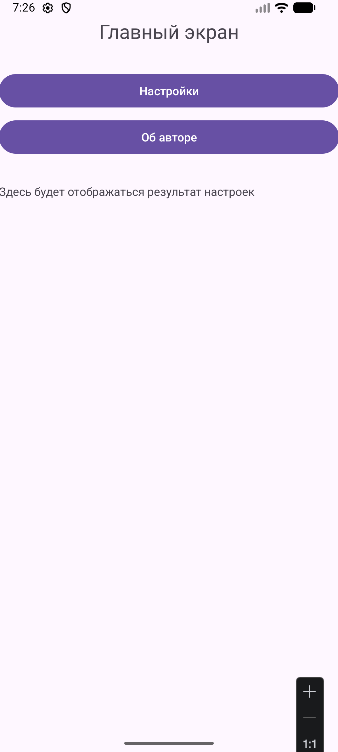
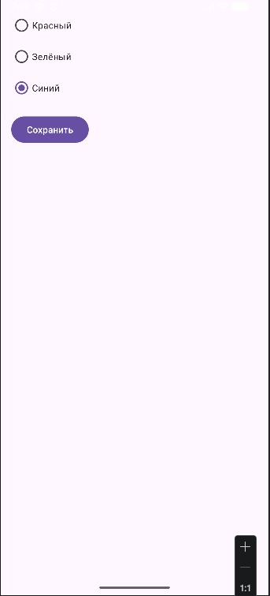
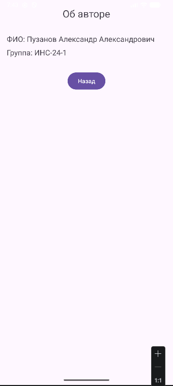
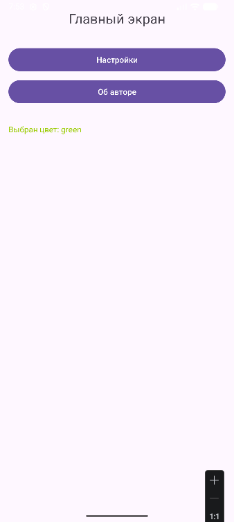

# Практическая работа №5. Работа с несколькими окнами (Activity)
#### Научиться создавать многоэкранные приложения, осуществлять навигацию между активностями (Activity) и передавать данные между ними с использованием объектов Intent и механизма startActivityForResult / onActivityResult.

Выполнил ИНС-б-о-24-1, Пузанов Александр Александрович

### Ход выполнения практической работы:
#### 1. Создание главной Activity:

#### 2. Activity "Настройки":

#### 3. Activity "Об авторе":

#### 4. Реализация навигации в MainActivity (вариант 2, Изменение цвета текста на главной странице):
Код:
```java
switch (color) {
    case "red":
        tvResult.setTextColor(getResources().getColor(android.R.color.holo_red_light));
        break;
    case "green":
        tvResult.setTextColor(getResources().getColor(android.R.color.holo_green_light));
        break;
    case "blue":
        tvResult.setTextColor(getResources().getColor(android.R.color.holo_blue_light));
        break;
}
```
Результат:


### Контрольные вопросы:
1. Что такое Intent? Какие существуют типы Intent (явные и неявные)? Приведите примеры использования каждого типа.
Intent - это объект для запуска Activity или передачи данных
Типы:
- явный (explicit) - указание конкретного класса
Intent intent = new Intent(this, SettingsActivity.class);
startActivity(intent);
- неявный (implicit) - описание действия
Intent intent = new Intent(Intent.ACTION_VIEW);
intent.setData(Uri.parse("https://google.com"));
startActivity(intent);
2. Как передать данные из одной Activity в другую с помощью Intent? Какие ограничения на типы передаваемых данных существуют?
Через putExtra():
intent.putExtra("key", "value");
Получение:
String data = getIntent().getStringExtra("key");
Ограничения:
- только примитивы, String, Serializable, Parcelable
- большие данные передавать нельзя
3. В чем разница между методами startActivity() и startActivityForResult()? В каких случаях используется каждый из них?
startActivity() - открыть экран
startActivityForResult() - открыть и получить результат обратно
4. Опишите назначение методов setResult() и finish() в контексте возврата данных из дочерней Activity.
setResult() - положить данные для возврата
finish() - закрыть Activity
5. Что произойдёт, если не зарегистрировать Activity в файле AndroidManifest.xml?
Приложение упадёт с ошибкой (ActivityNotFoundException)
6. Какие методы жизненного цикла Activity вызываются при переходе от MainActivity к SettingsActivity и при возврате обратно?
Переход:
MainActivity: onPause()
SettingsActivity: onCreate() -> onStart() -> onResume()
Возврат:
SettingsActivity: onPause() -> onStop() -> onDestroy()
MainActivity: onRestart() -> onStart() -> onResume()
7. Для чего используется requestCode в методе startActivityForResult()? Как обрабатываются несколько различных запросов в onActivityResult()?
Это идентификатор запроса. Нужен чтобы отличать разные вызовы.
В onActivityResult() проверяется requestCode и обрабатывается нужный результат
